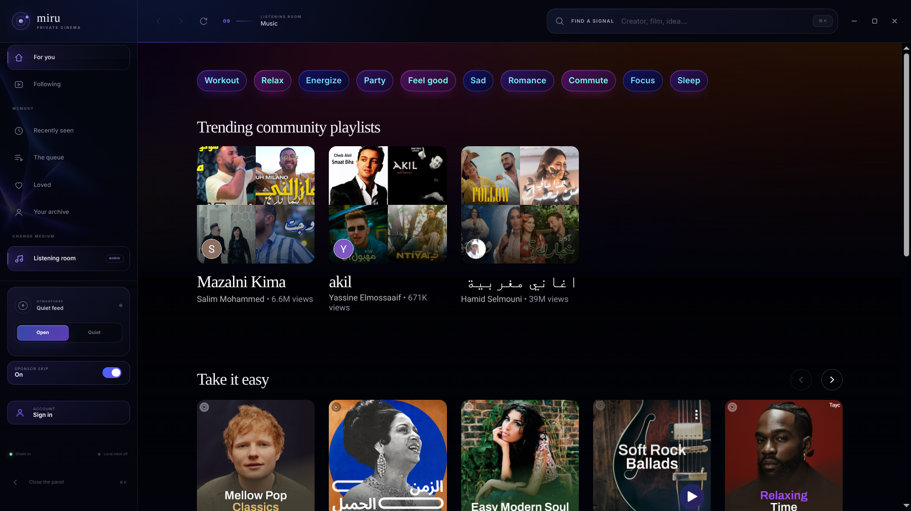

# miru

*Less noise. More signal.*

A private desktop client for YouTube and YouTube Music, built on Electron. It loads the real site inside its own dark violet interface and removes most of what makes YouTube tiring.



## Features

- **Custom look** for YouTube and YouTube Music: serif headings, themed mood chips, violet play buttons and progress bars.
- **Ad blocking**: network and cosmetic filtering, plus stripping pre-roll and mid-roll ads from the player data.
- **Sponsor skipping**: uses the crowd-sourced SponsorBlock database to skip mid-video sponsors and self-promotion, and nothing else. Undo toast, sidebar toggle.
- **Quiet feed**: hides Shorts, and optionally gaming, comedy and clickbait, using block lists, keyword scoring, channel categories and learned channel reputation. Unclear items stay visible.
- **Sign-in helper**: Google blocks sign-in in embedded browsers, so miru signs in through your own browser and imports the session.

Linux is tested. Windows builds are included, but the Windows sign-in helper is untested.

Not affiliated with YouTube, Google or SponsorBlock.

## Run the source

Install Node.js 22.12 or newer, then run:

```sh
npm install
npm start
```

## Make a copy for another PC

Build the folder for the recipient's operating system:

```sh
npm run package:windows
npm run package:linux
```

The finished copies appear in `dist/`:

- Windows 10/11 x64: send the entire `miru-win32-x64` folder. The recipient
  extracts it and runs `miru.exe`.
- Linux x64: send the entire `miru-linux-x64` folder. The recipient extracts it
  and runs `miru`.

The recipient does not need Node.js, npm, or an installer. Zip the complete
folder before sending it; the executable depends on the files beside it.

Each PC keeps its own settings, YouTube session and filtering choices. They are
not embedded in the portable folder. The builds are unsigned, so Windows may
show an “Unknown publisher” SmartScreen warning the first time they run.

macOS uses the same source code, but a distributable `.app` should be built and
signed on a Mac to avoid Gatekeeper restrictions.
